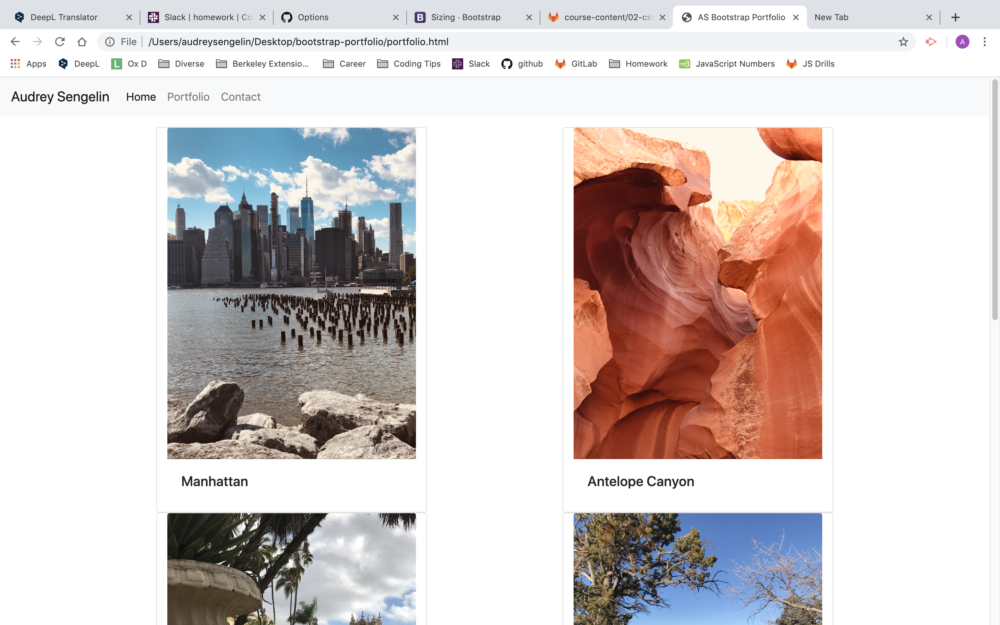

# Bootstrap-Portfolio

## Summary
I created a portfolio site using Bootstrap.

## Steps
I created different elements on a HTML page.

Using Bootstrap utilities as 'Borders'and 'Flex' to center the items, I was able to style my components.
I uses also a Bootstrap nav bar to link my differents html files.
Again using Bootstrap, I created a Contact page.

I add a CSS file with the Eric Meyer's reset.

On my portfolio page, I used a Bootstrap grid rows to align my pictures and add the location where I took the pictures.

I explained the biggest steps I made to the local repository, and then pushed them to GitHub.

I went to my GitHub repositories and scroll down to find the right repository.

I deployed my site by using GitHub pages to create a live site.

## Technologies used
HTML
CSS
Bootstrap
Git
GitHub

## Author Links
[GitHub](https://github.com/AudreySen)
