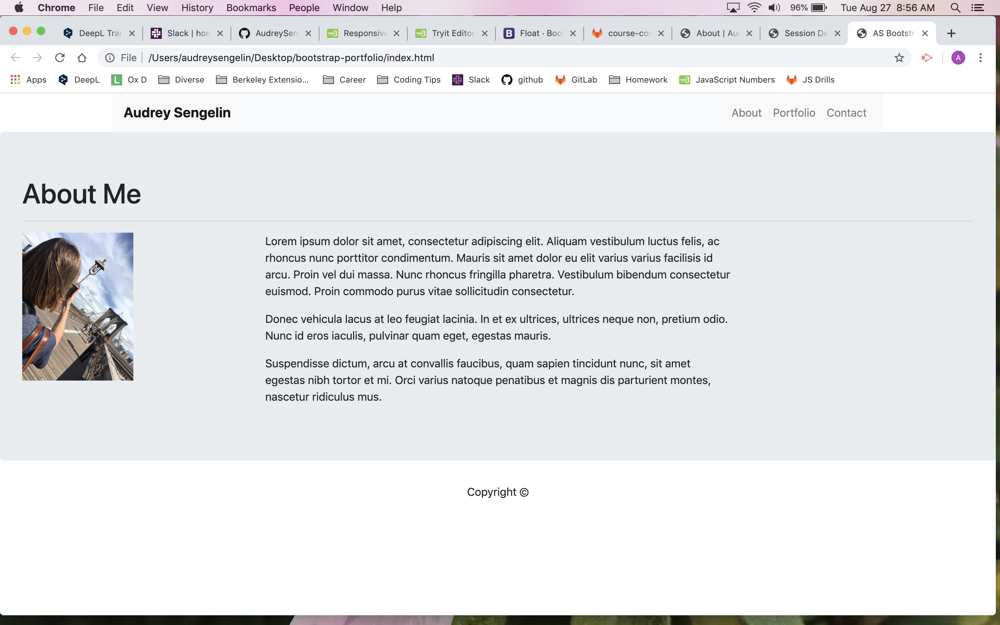
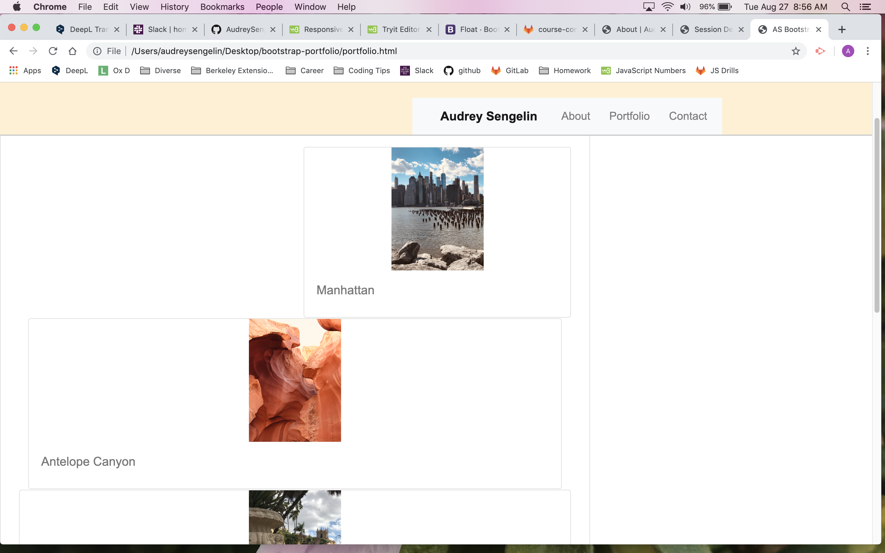
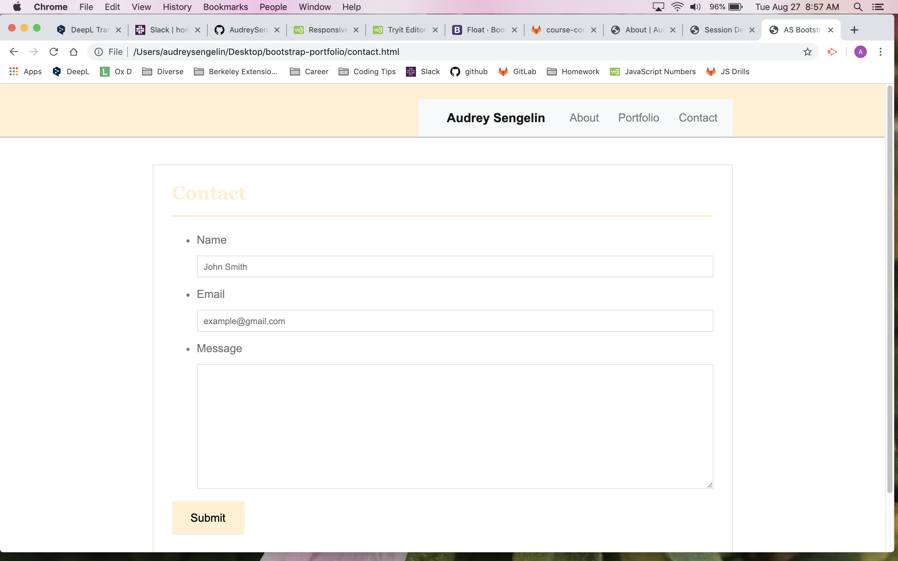

# bootstrap-portfolio
 IMAGE

Summary
Using Bootstrap, I created a portfolio with three files: an index file, a portfolio file with pictures and a contact file which are linked together.

Steps
I first adjusted different elements on the HTML page.
Whith Bootstrap, I use a rules to add pictures to my portfolio page.
I also used Bootstrap to

Then I added a CSS sheet to style the HTML document.

After adding backgrounds colors font colors, I mostly focused on widths, heights and paddings of the elements to made them fit in the framework.

Each time I made changes to the local repository, I pushed them to GitHub.

I went to my GitHub repositories. I scroll down to find the right repository.

I deployed my site by using GitHub pages to create a live site.

Technologies used
HTML
CSS
Bootstrap
Git
GitHub
Author Links
GitHub